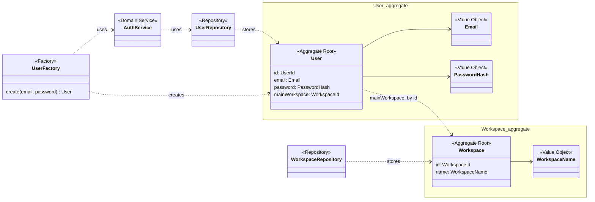
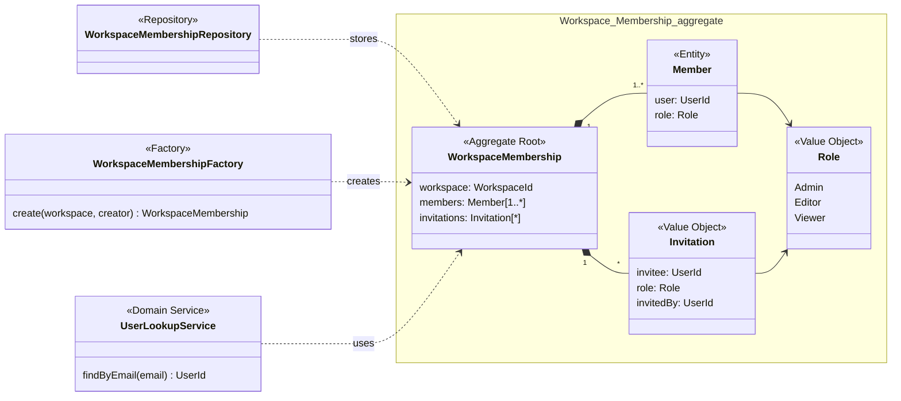
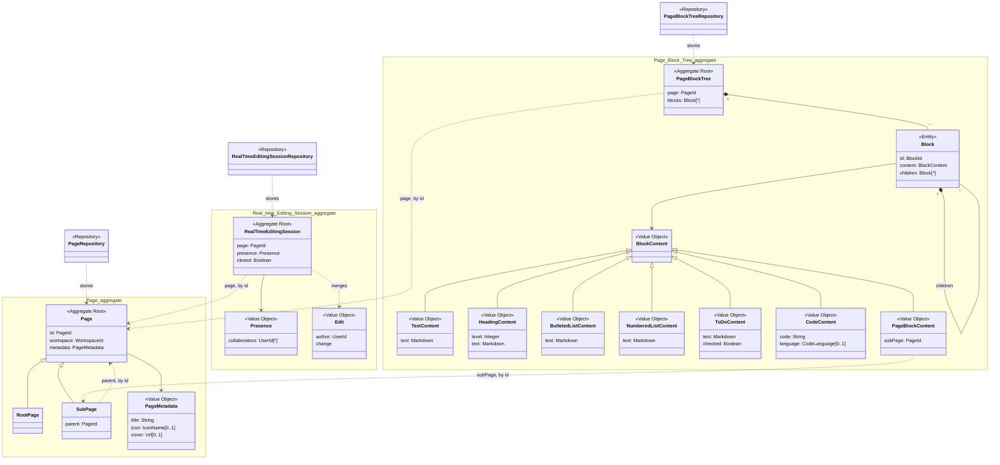
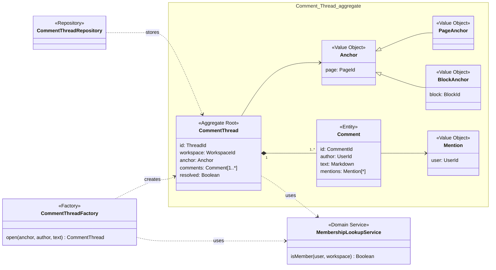
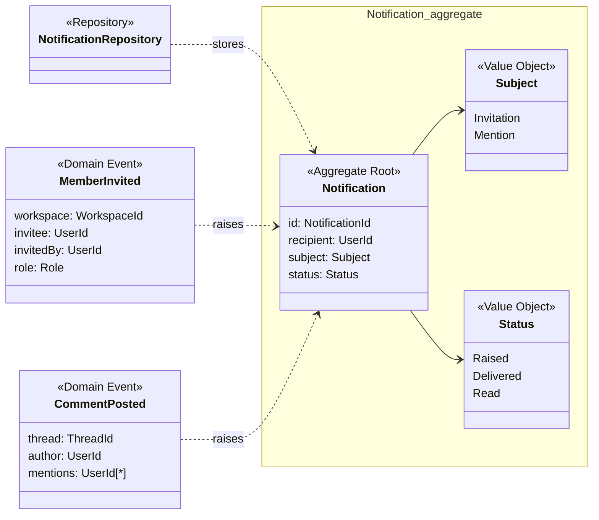

## Tactical Design

### Building blocks

Each bounded context has its own model, drawn as a UML class diagram with the DDD stereotypes `Aggregate Root`, `Entity`, `Value Object`, `Repository`, `Factory`, `Domain Service` and `Domain Event`. A box groups the classes of one aggregate. Every aggregate root has a repository that stores and loads it whole, and a factory only where creating it has a rule to keep.

Three rules shape every aggregate:

1. **Only the root is referenced from outside.** Inner entities, such as the blocks of a Page
   Block Tree, change only through a command on the root, which checks the invariants first.
2. **Aggregates refer to each other by identity.** A Page holds a `WorkspaceId`, never the
   Workspace. Across contexts the identities are the only thing shared: `UserId`, `WorkspaceId`,
   `PageId`, `BlockId`.
3. **One command changes one aggregate, in one transaction.** A rule that spans two aggregates is
   kept by a policy that reacts to an event, so it holds eventually rather than at once. Those
   rules are collected in [Rules across aggregates](#rules-across-aggregates).

For each aggregate, the commands are listed with who issues them: an actor, named by the role
the command requires, or a policy. A role is held by Membership, so the commands of the other
contexts check it from outside, as summarised in [Roles](#roles).

### Account

#### User

The identity that signs in (US-01), and the owner of the user's preferences.

- The email address is unique among users. The rule spans every User, so before a new user is created the User factory asks the `AuthService` to check the address against the `UserRepository`.
- The password is kept only as a `PasswordHash`; signing in compares against it and changes no
  state.
- The main workspace is one the user is a member of. Membership holds that fact, so the check is
  made against it (see [Roles](#roles)).

| Command | Issued by | Event |
|---|---|---|
| Register | Visitor | User Registered |
| Sign in | User | User Signed In |
| Set main workspace | User; policy *whenever a user's first workspace is created, make it their main workspace* | Main Workspace Changed |

The main workspace is a preference of one user, while a workspace is shared by all its members.
Keeping it on Workspace, as the board did, would need a flag per member, and changing the main
workspace would update two workspaces in one transaction. The active workspace is not in the
model at all: switching workspace is a navigation choice of the client, with no rule to protect
and no policy reacting to it, served by the *Workspace directory* read model.

#### Workspace

A separate space of pages (US-02). The name is a `WorkspaceName`, never blank.

- Only an Admin of the workspace renames or deletes it.
- A deleted workspace accepts no further command. Its root page and its Workspace Membership are
  removed by policies, not in the same transaction.

| Command | Issued by | Event |
|---|---|---|
| Create workspace | User; policy *whenever a user registers, create their first workspace* | Workspace Created |
| Rename workspace | Admin | Workspace Renamed |
| Delete workspace | Admin | Workspace Deleted |

### Membership

#### Workspace Membership

Who belongs to one workspace, with which role, and who has been invited to it (US-03). It is
identified by the `WorkspaceId` of its workspace.

- **A workspace always keeps at least one Admin.** Change member role, Remove member and Leave
  workspace are refused when they would leave no Admin: the last Admin has to promote another
  member before stepping down or leaving. The board had this rule as a purple sticky, but it
  forbids an operation rather than reacting to an event, so it is an invariant, not a policy.
- The membership starts with the creator of the workspace as its only member, an Admin. The `WorkspaceMembershipFactory` creates it that way, with no invitation, so there is no moment without an Admin.
- A user is a member at most once, with exactly one role.
- Only an Admin invites, changes roles and removes members. This check is local, since the roles
  live here.
- An invitation is addressed to a registered user, who receives it as an in-app notification (US-10), and who is neither a member nor already invited. It carries the role the invitee will have, chosen by the Admin.
- The Admin invites by email. The `UserLookupService` asks Account whether the address belongs to a registered user and gets their `UserId`; only then does the membership add the invitation. The other checks are local to the membership.
- Only the invitee accepts or declines an invitation, and either answer ends it. An invitation does not expire: it stays pending until the invitee answers. It never changes in between, and a user has at most one pending invitation per workspace, so it is a value object told apart by its invitee.

| Command | Issued by | Event |
|---|---|---|
| Create workspace membership | Policy *whenever a workspace is created, accept the creator as Admin*, carried out by the factory | Member Joined |
| Invite member | Admin | Member Invited |
| Accept invitation | Invitee | Member Joined |
| Decline invitation | Invitee | Invitation Declined |
| Change member role | Admin | Member Role Changed |
| Remove member | Admin | Member Removed |
| Leave workspace | Member | Member Left |
| Delete workspace membership | Policy *whenever a workspace is deleted, delete its membership* | Workspace Membership Deleted |

### Editing

#### Page

A document of a workspace, with its metadata and its place in the page tree (US-04, US-05).

- **A page is either the root page of its workspace or a sub-page.** `RootPage` and `SubPage` are the two forms of the one root of the Page aggregate, and a page never turns from one into the other. Only a sub-page has a parent, and it always has one.
- **Each workspace has exactly one root page.** It is created only by the policy on Workspace Created and deleted only by the policy on Workspace Deleted. Its `PageId` is derived from the `WorkspaceId`, so a second root page of the same workspace would have the same identity and cannot be stored: the rule holds without looking at the other pages.
- **A sub-page is created, moved and deleted only through its page block.** Inserting, moving or
  deleting the page block in the tree of the parent page fires the matching command on Page. Each
  sub-page therefore has exactly one page block, and nothing flows back from Page to the block,
  so the loop raised while reviewing the board cannot happen.
- The parent of a sub-page is the page whose tree holds its page block, in the same workspace.
- Deleting a page is final (US-04): its content and its sub-pages are deleted with it, by
  policies.
- The metadata is set on the page itself or by updating its page block; both end up on Page. The
  page block shows the title, icon and cover through the read model, without keeping a copy.
- The title is plain text. Icon and cover are optional. The icon is the name of an icon from the Lucide set, which the client draws, so the page stores no image. The cover is a link to an image, because no story asks for uploading files.

| Command | Issued by | Event |
|---|---|---|
| Create page | Policies *whenever a workspace is created, create its root page* and *whenever a page block is inserted, create the sub-page* | Page Created |
| Set title, icon, cover | Editor; policy *whenever a page block is updated, update its metadata* | Page Metadata Changed |
| Move page | Policy *whenever a page block is moved, move it in the tree as well* | Page Moved |
| Delete page | Policies *whenever a page block is deleted, delete the page as well*, *whenever a page is deleted, delete its content and sub-pages* and *whenever a workspace is deleted, delete its root page* | Page Deleted |

#### Page Block Tree

The content of one page (US-06, US-07). It is identified by the `PageId` of its page and starts
empty together with it.

- The blocks form an ordered tree: every block has exactly one parent, the page or another block,
  and a position among its siblings. A block cannot be nested under itself or one of its
  descendants.
- The type of a block is the subtype of its `BlockContent`, and each subtype holds only the fields its type needs. Text is Markdown (BR-03), so a heading also has its level, from 1 to 6 as in Markdown. A to-do has its checkbox, and a page block holds only its sub-page, so no other block can refer to one. A code block keeps its code as plain text, not Markdown, and may name its language in one word, the one written after the opening fence of a Markdown code block (`python`).
- Update block can turn a block into another type by replacing its content. The block keeps its `BlockId`, its place in the tree and the comment threads anchored to it. Page blocks are the exception: no block becomes a page block and a page block becomes nothing else, because a sub-page is created and deleted only by inserting and deleting its page block.
- Deleting a block deletes the blocks nested in it. Block Deleted lists the page blocks removed
  with them, so that every sub-page underneath is deleted, not only the top one.
- A new block type is a new subtype of `BlockContent` and its rendering, both inside Editing, with no change to any other aggregate or context (QA-09). The content is saved as the name of its type plus its fields, so a new type needs no change to the persistence schema.

| Command | Issued by | Event |
|---|---|---|
| Insert block | Policy *when edits are merged, apply them to the page block tree* | Block Inserted |
| Update block | Same policy | Block Updated |
| Move or nest block | Same policy | Block Moved |
| Delete block | Same policy | Block Deleted |
| Delete block tree | Policy *whenever a page is deleted, delete its content and sub-pages* | Block Tree Deleted |

#### Real-time Editing Session

The shared editing of one page (US-08). It is identified by the `PageId` of its page. As agreed
while reviewing the board, the session exists even with a single collaborator: the first Join
session opens it, so editing alone and editing together follow the same path.

- Only a collaborator who has joined can submit edits, and only with a role that may change the
  content. A Viewer can join to follow the edits and appear in the presence, but cannot submit.
- Concurrent edits are merged into one result that every collaborator converges to, and no
  acknowledged edit is dropped (QA-05). Where edits are ordered and merged is PP-01, settled by an
  ADR; the `change` carried by an `Edit` takes its form from that decision.
- A closed session accepts no join and no edit. It is closed when its page is deleted, and the
  collaborators learn it from Session Closed itself: the *notify its participants* of the policy
  is that event, not an in-app notification, which US-10 keeps for invitations and mentions.

| Command | Issued by | Event |
|---|---|---|
| Join session | Collaborator | Session Joined |
| Leave session | Collaborator | Session Left |
| Submit edit | Editor | Edits Merged |
| Close session | Policy *when a page is deleted, close its editing session and notify its participants* | Session Closed |

### Discussion

#### Comment Thread

A conversation attached to a page or to one of its blocks (US-09).

- The anchor is fixed when the thread opens and never changes. A page anchor holds a thread on the whole page, a block anchor a thread on one block. Both name the page, because a `BlockId` alone does not tell Discussion which page the block is on, and the threads of a page must be found when it is shown or deleted.
- A thread is never empty: the `CommentThreadFactory` opens it together with its first comment.
- A resolved thread accepts no new comments.
- A mention names a member of the workspace. The members live in Membership, so the thread and its factory ask the `MembershipLookupService` whether the author of a comment, every user it mentions and whoever resolves the thread are members. How the service learns the members is PP-04.
- Any member of the workspace posts and resolves, whatever their role: a comment does not
  change the content of the page, so a Viewer can take part in the discussion too.

| Command | Issued by | Event |
|---|---|---|
| Post comment | Collaborator | Comment Posted |
| Resolve thread | Collaborator | Thread Resolved |
| Delete thread | Policies *whenever a page is deleted, delete its comment threads* and *whenever a block is deleted, delete its comment threads* | Thread Deleted |

### Notification

#### Notification

A message telling one user about an invitation or a mention (US-10). It is raised only by policies, in reaction to Member Invited from Membership and Comment Posted from Discussion. Those events belong to the contexts that publish them; the diagram shows them here, with the fields Notification reads, because they are the only way a notification is created.

- The status only moves forward: Raised, then Delivered, then Read.
- Delivery is best effort and may be repeated: delivering an already delivered notification
  changes nothing.
- Only the recipient marks it as read.
- Mentioning oneself raises nothing: the policy fires only when *another* user is mentioned.

| Command | Issued by | Event |
|---|---|---|
| Raise notification | Policies *when MemberInvited then send the invitation* and *when another user is mentioned* | Notification Raised |
| Deliver notification | Policy *notification delivery with best effort* | Notification Delivered |
| Mark as read | User | Notification Read |

### Rules across aggregates

The rules that span more than one aggregate, and the policies that keep them. Between the event
and the reaction the rule does not hold yet: right after Workspace Created, for instance, the
root page may not exist, and the read models must allow for it.

| Rule | Kept by | Traces to |
|---|---|---|
| A new user has a workspace, and it is their main one | *Whenever a user registers, create their first workspace*; *whenever a user's first workspace is created, make it their main workspace* | US-01, US-02 |
| A workspace has an Admin from its creation | *Whenever a workspace is created, accept the creator as Admin* | US-03 |
| A workspace has exactly one root page | *Whenever a workspace is created, create its root page*, plus the identity of the root page, derived from its workspace | US-04 |
| Every page block has its sub-page, and every sub-page its page block | *Whenever a page block is inserted, moved, deleted, updated…* | US-04 |
| Merged edits reach the content of the page | *When edits are merged, apply them to the page block tree* | US-08 |
| Deleting a workspace deletes everything in it | *Whenever a workspace is deleted, delete its root page*, then the cascade below; *whenever a workspace is deleted, delete its membership* | US-02, PP-05 |
| Deleting a page deletes its content, sub-pages, session and threads | *Whenever a page is deleted, delete its content and sub-pages*; *when a page is deleted, close its editing session*; *whenever a page is deleted, delete its comment threads* | US-04, US-09, PP-05 |
| Deleting a block deletes the threads anchored to it | *Whenever a block is deleted, delete its comment threads* | US-09, PP-05 |
| Invited and mentioned users are told | *When MemberInvited then send the invitation*; *when another user is mentioned* | US-10 |

### Roles

The roles live in Membership, but most of the commands that need them belong to other contexts.
The table states which role each command requires; the relations that carry them are in the
[Context Map](#context-map), and how the roles reach the other contexts is PP-04.

| Command | Context | Admin | Editor | Viewer |
|---|---|---|---|---|
| Rename workspace, Delete workspace | Account | ✓ | | |
| Invite member, Change member role, Remove member | Membership | ✓ | | |
| Leave workspace | Membership | ✓ | ✓ | ✓ |
| Set title, icon, cover; Submit edit | Editing | ✓ | ✓ | |
| Join session | Editing | ✓ | ✓ | ✓ |

Three more checks read Membership without a role: the main workspace of a user is one the user
is a member of, only a member posts a comment or resolves a thread, and a mention names a member
of the workspace.

### Changes from the board

The model refines the board, and these changes are to be carried back to it:

- *Set main workspace* moves from Workspace to User, and *Switch workspace* with *Workspace
  Switched* leave the model, as explained under [User](#user).
- *Rename workspace* → *Workspace Renamed* is added, as US-02 requires.
- *Decline invitation* → *Invitation Declined* settles PP-02, and *Leave workspace* → *Member
  Left* settles PP-03. The sticky *not possible to leave the workspace if you are last Admin*
  becomes an invariant of Workspace Membership.
- The deletion policies of Membership and Discussion, with *Workspace Membership Deleted* and
  *Thread Deleted*, settle PP-05.
- The Editor no longer issues *Move page* and *Delete page*: the Editor moves or deletes the page
  block, and the policies do the rest.
- Moving a sub-page under a different parent page is not modelled: a page block moves only within
  the tree of its own page.
